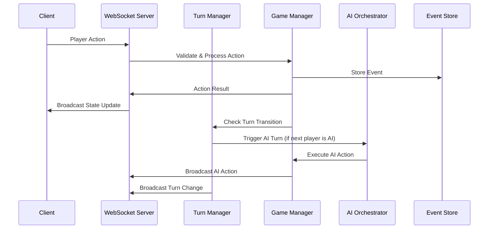
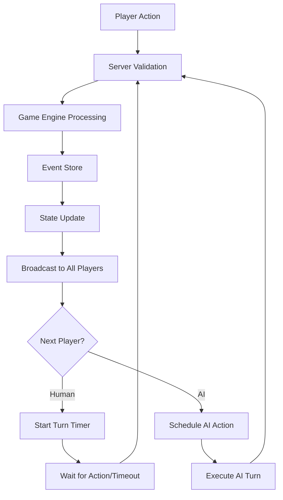

# Multiplayer Architecture & Implementation Plan

## 🎯 Overview

This document outlines the comprehensive plan for implementing a **Server-Authoritative Game Engine** with real-time multiplayer synchronization, AI integration, and robust turn management for the Settlers game.

## 📋 Current State Analysis

### ✅ What's Already Implemented

#### Event-Driven Architecture
- **Event Store**: Robust event sourcing with segregated tables:
  - `player_events` - Player join/leave/AI actions
  - `game_events` - Game state changes, actions, phase transitions
  - `friend_events` - Social features
  - `game_invite_events` - Game invitations
- **Event Sequencing**: Atomic sequence numbers ensuring deterministic ordering
- **Event Processing**: Complete processor pattern with registry (`ProcessorRegistry`)
- **Event Projection**: Lobby state projected from events for consistency

#### Server-Authoritative Foundation
- **Game Engine**: Complete core game logic in `packages/game-engine/`
  - Action processors for all game actions
  - State validation and rule enforcement
  - Turn progression logic (`EndTurnProcessor`)
- **Database Integration**: PostgreSQL with Drizzle ORM
- **Session Management**: JWT-based authentication and authorization

#### AI System
- **AI Framework**: Sophisticated decision-making with goal-based planning
- **Auto Players**: Complete automation system (`AutoPlayer` class)
- **AI Integration**: AI players integrated into lobby system
- **Difficulty/Personality**: Configurable AI behavior

#### WebSocket Infrastructure
- **Unified Server**: Single WebSocket server handling all real-time communication
- **Connection Management**: Session-based connections with deduplication
- **Message Routing**: Proper message type segregation (game/social/system)

### ❌ Critical Missing Components

#### Turn Management & Timing
- ❌ Turn timers and automatic progression
- ❌ Server-side turn orchestration
- ❌ AI turn automation triggers
- ❌ Phase transition automation

#### Real-Time Game State Sync
- ❌ Game state broadcasting to all players
- ❌ Action result broadcasting
- ❌ State reconciliation mechanisms
- ❌ Optimistic update handling

#### Spectator & Disconnection Handling
- ❌ Spectator/observer mode
- ❌ Graceful disconnection recovery
- ❌ Reconnection state restoration
- ❌ Pause/resume functionality

#### Frontend Integration
- ❌ Automatic turn UI updates
- ❌ Real-time game state synchronization
- ❌ Turn indicators and timers
- ❌ Action validation feedback

## 🏗️ Implementation Plan

### Phase 1: Server-Side Turn Orchestration

#### 1.1 Turn Manager Service

```typescript
// File: apps/backend/src/services/turn-manager.ts
export class TurnManager {
  private turnTimers = new Map<string, NodeJS.Timeout>()
  private gameStates = new Map<string, GameState>()
  private config = {
    defaultTurnTimeMs: 120000, // 2 minutes
    aiThinkingTimeMs: 3000,    // 3 seconds
    maxActionsPerTurn: 20
  }

  async startTurn(gameId: string, playerId: string, timeoutMs?: number): Promise<void>
  async endTurn(gameId: string, playerId: string, action?: GameAction): Promise<void>
  async handleTurnTimeout(gameId: string, playerId: string): Promise<void>
  async pauseGame(gameId: string, reason: string): Promise<void>
  async resumeGame(gameId: string): Promise<void>
  
  // AI Integration
  async scheduleAITurn(gameId: string, aiPlayerId: string): Promise<void>
  private async executeAIAction(gameId: string, aiPlayerId: string): Promise<void>
}
```

#### 1.2 Game State Manager

```typescript
// File: apps/backend/src/services/game-state-manager.ts
export class GameStateManager {
  async loadGameState(gameId: string): Promise<GameState>
  async updateGameState(gameId: string, newState: GameState): Promise<void>
  async processPlayerAction(gameId: string, playerId: string, action: GameAction): Promise<ProcessResult>
  
  // Real-time broadcasting
  async broadcastGameState(gameId: string, state: GameState): Promise<void>
  async broadcastAction(gameId: string, action: GameAction, result: ProcessResult): Promise<void>
  async broadcastTurnChange(gameId: string, newCurrentPlayer: string, timeRemaining: number): Promise<void>
  
  // State validation
  async validateGameState(gameId: string): Promise<{ valid: boolean; errors: string[] }>
  async reconcileState(gameId: string, clientState: Partial<GameState>): Promise<GameState>
}
```

#### 1.3 Enhanced WebSocket Messages

```typescript
// File: apps/backend/src/websocket/game-messages.ts
interface GameTurnMessage {
  type: 'turnStarted' | 'turnEnded' | 'turnTimeout'
  data: {
    gameId: string
    currentPlayer: string
    previousPlayer?: string
    timeRemaining: number
    phase: GamePhase
    availableActions?: string[]
  }
}

interface GameStateMessage {
  type: 'gameStateUpdate' | 'actionResult'
  data: {
    gameId: string
    gameState: GameState
    lastAction?: GameAction
    actionResult?: ProcessResult
    sequence: number
  }
}

interface GameControlMessage {
  type: 'gamePaused' | 'gameResumed' | 'gameEnded'
  data: {
    gameId: string
    reason?: string
    winner?: string
    finalState?: GameState
  }
}
```

### Phase 2: Real-Time Game State Broadcasting

#### 2.1 Enhanced WebSocket Server

```typescript
// File: apps/backend/src/websocket/game-websocket-server.ts
export class GameWebSocketServer extends UnifiedWebSocketServer {
  private gameStateManager: GameStateManager
  private turnManager: TurnManager
  
  // Game-specific message handlers
  private async handleGameAction(ws: WebSocket, message: GameActionMessage): Promise<void>
  private async handleEndTurn(ws: WebSocket, message: EndTurnMessage): Promise<void>
  private async handleJoinAsSpectator(ws: WebSocket, message: SpectatorMessage): Promise<void>
  
  // Broadcasting methods
  async broadcastToGame(gameId: string, message: WebSocketMessage): Promise<void>
  async broadcastToPlayers(gameId: string, message: WebSocketMessage): Promise<void>
  async broadcastToSpectators(gameId: string, message: WebSocketMessage): Promise<void>
  
  // Connection management
  private async handlePlayerReconnection(ws: WebSocket, session: GameSessionPayload): Promise<void>
  private async sendGameStateSync(ws: WebSocket, gameId: string): Promise<void>
}
```

#### 2.2 Game Action Pipeline

```typescript
// File: apps/backend/src/services/game-action-pipeline.ts
export class GameActionPipeline {
  constructor(
    private gameStateManager: GameStateManager,
    private turnManager: TurnManager,
    private wsServer: GameWebSocketServer
  ) {}
  
  async processAction(gameId: string, playerId: string, action: GameAction): Promise<{
    success: boolean
    result?: ProcessResult
    error?: string
    nextState?: GameState
  }> {
    // 1. Validate player can act
    // 2. Process action through game engine
    // 3. Update server state
    // 4. Broadcast to all players
    // 5. Check for turn/phase transitions
    // 6. Trigger AI turns if needed
  }
  
  private async validatePlayerAction(gameId: string, playerId: string, action: GameAction): Promise<boolean>
  private async handlePostActionEvents(gameId: string, result: ProcessResult): Promise<void>
  private async checkGameEndConditions(gameId: string, state: GameState): Promise<void>
}
```

### Phase 3: AI Turn Integration

#### 3.1 AI Turn Orchestrator

```typescript
// File: apps/backend/src/services/ai-turn-orchestrator.ts
export class AITurnOrchestrator {
  private aiPlayers = new Map<string, AutoPlayer>()
  
  async initializeAIPlayer(gameId: string, aiPlayerId: string, config: AIPlayerConfig): Promise<void>
  async executeAITurn(gameId: string, aiPlayerId: string): Promise<void>
  async scheduleAIAction(gameId: string, aiPlayerId: string, delayMs: number): Promise<void>
  
  // AI behavior management
  async updateAIConfig(gameId: string, aiPlayerId: string, config: Partial<AIPlayerConfig>): Promise<void>
  async pauseAI(gameId: string, aiPlayerId: string): Promise<void>
  async resumeAI(gameId: string, aiPlayerId: string): Promise<void>
  
  private async getAIDecision(gameId: string, aiPlayerId: string): Promise<GameAction | null>
  private async executeAIActionWithDelay(gameId: string, aiPlayerId: string, action: GameAction): Promise<void>
}
```

#### 3.2 AI Integration with Turn Manager

```typescript
// Enhanced TurnManager with AI integration
export class TurnManager {
  constructor(
    private aiOrchestrator: AITurnOrchestrator,
    private gameActionPipeline: GameActionPipeline
  ) {}
  
  async startTurn(gameId: string, playerId: string): Promise<void> {
    const gameState = await this.gameStateManager.loadGameState(gameId)
    const player = gameState.players.get(playerId)
    
    if (player?.isAI) {
      // Schedule AI turn with thinking delay
      await this.aiOrchestrator.scheduleAIAction(
        gameId, 
        playerId, 
        this.config.aiThinkingTimeMs
      )
    } else {
      // Start human player turn with timer
      this.startTurnTimer(gameId, playerId, this.config.defaultTurnTimeMs)
    }
    
    // Broadcast turn start to all players
    await this.wsServer.broadcastToGame(gameId, {
      type: 'turnStarted',
      data: { gameId, currentPlayer: playerId, timeRemaining: this.config.defaultTurnTimeMs }
    })
  }
}
```

### Phase 4: Frontend Turn Handling

#### 4.1 Game Turn Hook

```typescript
// File: apps/frontend/lib/use-game-turns.ts
interface GameTurnState {
  currentPlayer: string | null
  isMyTurn: boolean
  turnTimeRemaining: number
  phase: GamePhase
  availableActions: GameAction['type'][]
  canAct: boolean
  gameState: GameState | null
}

export function useGameTurns(gameId: string, sessionToken: string): {
  turnState: GameTurnState
  submitAction: (action: GameAction) => Promise<boolean>
  endTurn: () => Promise<boolean>
  isConnected: boolean
  error: string | null
} {
  // Real-time turn state management
  // WebSocket integration for turn updates
  // Action submission with optimistic updates
  // Turn timer countdown
}
```

#### 4.2 Game State Synchronization

```typescript
// File: apps/frontend/lib/use-game-state-sync.ts
export function useGameStateSync(gameId: string, sessionToken: string): {
  gameState: GameState | null
  isLoading: boolean
  isConnected: boolean
  lastUpdate: Date | null
  sendAction: (action: GameAction) => Promise<boolean>
  requestStateSync: () => Promise<void>
} {
  // Real-time game state updates
  // Optimistic updates with rollback
  // State reconciliation
  // Connection health monitoring
}
```

#### 4.3 Turn UI Components

```typescript
// File: apps/frontend/components/game/ui/TurnIndicator.tsx
export function TurnIndicator({ 
  currentPlayer, 
  isMyTurn, 
  timeRemaining, 
  phase 
}: TurnIndicatorProps): JSX.Element {
  // Visual turn indicator
  // Countdown timer
  // Phase display
  // Action hints
}

// File: apps/frontend/components/game/ui/ActionPanel.tsx
export function ActionPanel({ 
  availableActions, 
  onAction, 
  disabled 
}: ActionPanelProps): JSX.Element {
  // Available actions display
  // Action buttons with validation
  // End turn button
  // Action history
}
```

### Phase 5: Spectator & Disconnection Features

#### 5.1 Spectator System

```typescript
// File: apps/backend/src/services/spectator-manager.ts
export class SpectatorManager {
  async addSpectator(gameId: string, userId: string, userName: string): Promise<string>
  async removeSpectator(gameId: string, spectatorId: string): Promise<void>
  async broadcastToSpectators(gameId: string, message: WebSocketMessage): Promise<void>
  
  // Spectator permissions
  async canSpectateGame(gameId: string, userId: string): Promise<boolean>
  async getSpectatorView(gameId: string): Promise<GameState>
  
  private async createSpectatorSession(gameId: string, userId: string): Promise<GameSessionPayload>
}
```

#### 5.2 Disconnection Handling

```typescript
// File: apps/backend/src/services/disconnection-manager.ts
export class DisconnectionManager {
  private reconnectionTokens = new Map<string, ReconnectionData>()
  
  async handlePlayerDisconnection(gameId: string, playerId: string): Promise<void>
  async handlePlayerReconnection(gameId: string, playerId: string, reconnectionToken: string): Promise<GameState>
  async pauseGameForDisconnection(gameId: string, playerId: string): Promise<void>
  async resumeGameAfterReconnection(gameId: string): Promise<void>
  
  // Reconnection token management
  async generateReconnectionToken(gameId: string, playerId: string): Promise<string>
  async validateReconnectionToken(token: string): Promise<ReconnectionData | null>
  
  private async savePlayerState(gameId: string, playerId: string): Promise<void>
  private async restorePlayerState(gameId: string, playerId: string): Promise<void>
}
```

#### 5.3 Session Management Enhancement

```typescript
// Enhanced session types
interface GameSessionPayload {
  gameId: string
  playerId?: string
  userId: string
  playerName: string
  avatarEmoji: string
  authToken: string
  role: 'host' | 'player' | 'spectator' | 'observer'
  permissions: string[]
  expiresAt: number
  issuedAt: number
  gameCode?: string
  reconnectionToken?: string
}

interface ReconnectionData {
  gameId: string
  playerId: string
  userId: string
  disconnectedAt: Date
  savedState: Partial<GameState>
  turnPosition: number
  expiresAt: Date
}
```

## 🎮 Implementation Flow

### Server-Authoritative Game Loop



### Real-Time Synchronization Flow



## 📊 Performance & Scalability Considerations

### Database Optimization
- **Event Partitioning**: Partition events by game_id for better performance
- **Connection Pooling**: Use connection pooling for database connections
- **Caching**: Redis cache for active game states
- **Indexing**: Proper indexing on sequence numbers and timestamps

### WebSocket Scaling
- **Connection Limits**: Monitor and limit connections per game
- **Message Queuing**: Queue messages for disconnected players
- **Load Balancing**: Horizontal scaling with sticky sessions
- **Health Monitoring**: Connection health checks and automatic cleanup

### Memory Management
- **State Cleanup**: Remove completed games from memory
- **Event Pruning**: Archive old events to separate storage
- **Timer Management**: Proper cleanup of turn timers
- **AI Instance Management**: Reuse AI instances across games

## 🚀 Deployment Strategy

### Development Environment
1. **Local Setup**: Docker Compose with PostgreSQL + Redis
2. **Hot Reloading**: Bun with hot reload for backend development
3. **Database Migrations**: Automated migration system
4. **Testing**: Integration tests for multiplayer scenarios

### Production Environment
1. **Container Orchestration**: Kubernetes deployment
2. **Database**: Managed PostgreSQL with read replicas
3. **Caching**: Redis cluster for session/state caching
4. **Monitoring**: Comprehensive logging and metrics
5. **Auto-scaling**: Horizontal pod autoscaling based on connections

## 🧪 Testing Strategy

### Unit Tests
- Game engine logic validation
- AI decision making consistency
- Event processing accuracy
- Turn management edge cases

### Integration Tests
- Full multiplayer game simulations
- AI vs Human game scenarios
- Disconnection/reconnection flows
- WebSocket message handling

### Load Tests
- Multiple concurrent games
- High-frequency action processing
- Connection scaling limits
- Database performance under load

### End-to-End Tests
- Complete game flows with Playwright
- Multi-browser testing
- Mobile responsiveness
- Cross-platform compatibility

## 📝 Implementation Timeline

### Week 1-2: Core Turn Management
- Implement `TurnManager` service
- Add turn timers and timeout handling
- Integrate with existing game engine
- Basic AI turn automation

### Week 3-4: Real-Time Broadcasting
- Enhance WebSocket server for game state sync
- Implement `GameStateManager`
- Add action broadcasting
- State reconciliation mechanisms

### Week 5-6: Frontend Integration
- Create turn management hooks
- Real-time UI updates
- Turn indicators and timers
- Action validation feedback

### Week 7-8: AI & Spectator Features
- Complete AI turn orchestration
- Implement spectator mode
- Disconnection handling
- Reconnection state restoration

### Week 9-10: Testing & Polish
- Comprehensive testing suite
- Performance optimization
- Documentation completion
- Production deployment preparation

## 🔧 Configuration

### Game Settings
```typescript
interface GameConfiguration {
  turnTimeLimitMs: number        // Default: 120000 (2 min)
  aiThinkingTimeMs: number       // Default: 3000 (3 sec)
  maxPlayersPerGame: number      // Default: 4
  allowSpectators: boolean       // Default: true
  maxSpectatorsPerGame: number   // Default: 10
  disconnectionTimeoutMs: number // Default: 300000 (5 min)
  gameTimeoutMs: number          // Default: 14400000 (4 hours)
}
```

### AI Configuration
```typescript
interface AIConfiguration {
  difficulties: ('easy' | 'medium' | 'hard')[]
  personalities: ('aggressive' | 'balanced' | 'defensive' | 'economic')[]
  maxAIPlayersPerGame: number
  aiActionDelayRange: [number, number] // [min, max] ms
}
```

This comprehensive plan provides a roadmap for implementing a robust, server-authoritative multiplayer game engine with all the features you specified. The architecture leverages your existing excellent foundation while adding the missing real-time synchronization, turn management, and AI integration components. 